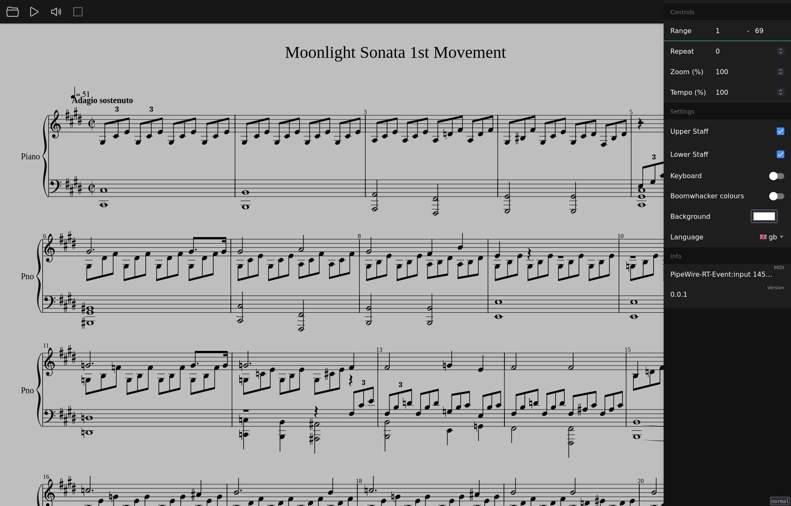

# midi.academy

Interactively play along with a MusicXML score using a MIDI instrument.



The core features are

 - **visual hints**: the onscreen keyboard highlights which notes should currently be performed
 - **follows you**: playback will not continue until the correct notes are performed
 - **audio feedback**: when an incorrect note is performed, output will use the harpsichord sound bank

Some additional functionality includes:

- start and end measures
- repetition count
- tempo selection
- left and right hand toggles
- page zoom
- background color theming


## lighted keys

There is support for sending data over a serial port (e.g., USB).
This can be used to light an LED strip above the physical keyboard, replacing the functionality of the onscreen keyboard.

The API conforms to the following interface

- 0-87: toggle respective note
- 88: reset (i.e., turn off all notes)

Each command is terminated with a newline character (`\n`).

### example

There's a lot a leeway here but, as a concrete example, the author uses/recommends the following setup:

```
computer -usb-> microcontroller -wires-> LEDs
```

The main advantage here is that data and power share this single chain.

Specifically,

- a 60 LED/meter WS8212 strip (~4 meters worth)

  > **NOTE**: this requires putting slight folds in the strip between LEDs to match the keyboard spacing

- a NodeMCU microcontroller (flashed with ESPHome; see [my config](https://gitlab.com/hall/hall/-/blob/25ca6f24ce4ebda511110a3dbfb01665a5a79d46/cluster/esphome/livingroom.nix#L35-69) for inspiration)

- connect the wires from the LED strip to the microcontroller

  - red -> VIN (for 5v power)
  - white -> GND (ground)
  - green -> GPIO12 (data)

- select "Connect" in the sidebar and choose your device

## attribution

This project was initially forked from https://github.com/rvilarl/pianoplay.
